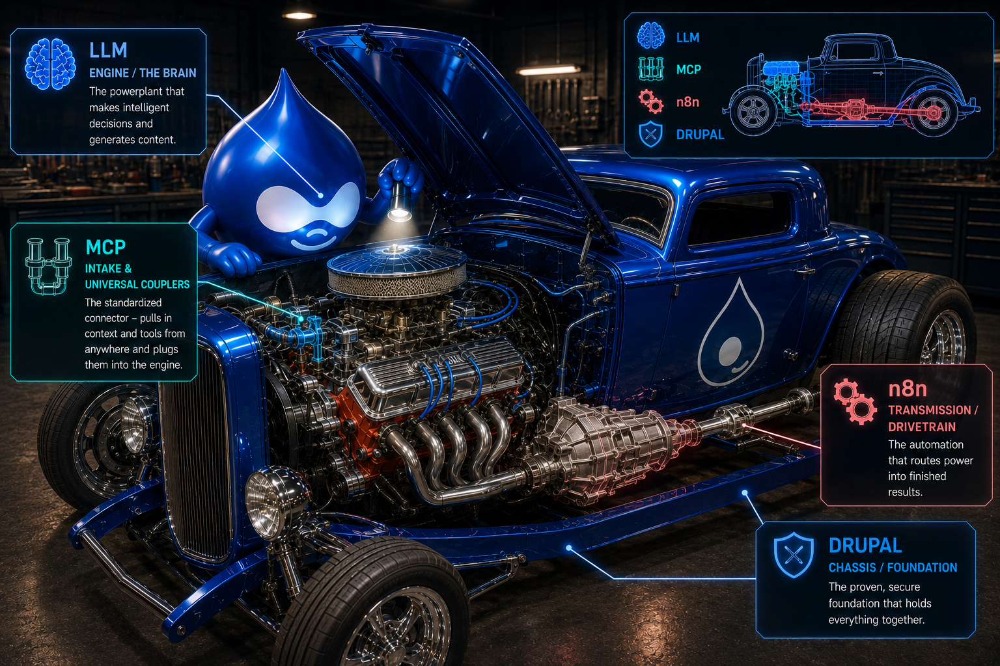

<p align="center">
  
</p>

<h1 align="center">Drup-AID</h1>
<p align="center"><em>the self-building, AI-Designed flavor of Drupal</em></p>

> **Drup-AID** = **Drup**al + **AID** (**AI D**esign). It reads like Kool-Aid on purpose — drink the Drup-AID. 🧃
> Install it on an ordinary hosting account, point it at one LLM API key, and it comes up running: you **build and edit your site by chatting with it**. No Docker, no GPU, no local model to babysit.

📺 **Free video course — the [Drup-AID Developer Academy](https://www.drup-aid.com/academy):** 16 short, code-level chapters on building AI agents on Drup-AID, from a fresh Drupal 11 dev environment to a deployed, secured minion.

---

## What it is

Drup-AID is a thin, opinionated **assembly of Drupal's official AI rails** + a small set of **guardrailed minions** (focused AI agents), packaged so a non-technical owner can run an AI-driven site without touching code. It rides — it does not replace — the [Drupal AI initiative](https://www.drupal.org/about/starshot/initiatives/ai): `ai`, `ai_agents`, `canvas` + `canvas_ai`, and a provider.

The differentiator isn't "autonomous Drupal" (the initiative already ships that). It's the **turnkey packaging** — *one command, point at a key, running* — which the official project deliberately leaves to assemblers.

## The out-of-the-box team

A fresh install brings up a **master orchestrator** you talk to in plain language. It routes each request to the right specialist — no manual wiring:

| Agent | What it does |
|---|---|
| 🛎️ **Concierge** | Greets visitors and gives a quick local status — time, weather, and headlines — read automatically from your site's own settings. No setup. |
| 🔍 **SEO Specialist** | Audits any page for technical SEO + AI-search (GEO) visibility and **prescribes the exact fix — twice**: plain English for you, precise steps for your developer. |
| ✍️ **Content Writer** | Drafts and publishes articles in your business's voice, as rollback-able revisions. |
| 🛡️ **Security Monitor** | Reads Drupal's *own* update and status reports — pending security releases, exposure warnings, risky account settings, form-spam gaps — and prescribes each fix, plain + technical. |
| 📥 **Lead Desk** | Drops a friendly contact bubble on your site; a visitor's name, phone, and email get emailed straight to you and logged for review. |

Two principles run through all of them: they **prescribe fixes, they don't act behind your back** (read-only agents return the exact fix; the Content Writer is the safe exception, because Drupal content is revisioned), and every recommendation comes in **plain English *and* technical** tiers.

### How the pieces map — the hot rod

<p align="center">
  
</p>

- **Drupal** is the **chassis** — the proven, secure foundation everything bolts to.
- The **LLM** is the **engine** — the brain that makes decisions and generates content.
- **MCP** is the **intake + universal couplers** — the standard connector that pulls in context and tools and plugs them into the engine.
- **n8n** is the **transmission** — the automation that routes power into finished results.

See **[ARCHITECTURE.md](ARCHITECTURE.md)** for the wiring.

## How it works

The one component that ever needed special infrastructure was a *local* LLM. Swap that for a **cloud provider** and the whole thing becomes pure PHP making outbound HTTPS calls — so it installs like any normal Drupal site:

```
Recipe (drup_aid)  ─►  ai + ai_agents + canvas_ai + ai_provider_anthropic + key + minion
                        │
   your LLM API key ───►│  (one setup step)
                        ▼
   chat: "change the homepage headline to X"  ─►  the minion edits the node (rollback-able revision)
```

## The Agent Cockpit

`modules/drup_aid_cockpit` ships a "team chat" admin screen at `/admin/drup-aid/cockpit`: the master agent and every specialist in one room. Send a request, watch the master delegate, and see each agent's work land as its own chat bubble. Click any agent for its full profile — model, skills, MCP servers, team.

- **Demo mode (default):** a scripted, zero-cost walkthrough of the delegation flow.
- **Live mode (opt-in):** click the mode badge to run your real agents through the AI Agents Explorer transport. Every send uses your AI provider credits, so it asks before going live.
- **Artwork:** ships with neutral initial badges; drop PNGs into `images/agents/` to skin your team.

## The two-persona design

Drup-AID separates **what your customers see** from **how you change what your business does**:

- **The site (Drupal + AI agents)** — what visitors experience: content, support chat, knowledge base, tickets. The owner changes it by talking to the agent team. This core flavor needs no extra services.
- **Visual automations (the n8n layer)** — the operations half of the platform, and the operator's surface. Business automations — lead follow-up, marketing sequences, billing nudges — live as *visual flows*: boxes and arrows a non-developer can open, read, and safely edit. Drag, click, save — no code. Everything your business *does* runs through this layer, and novice-editable flows are a core part of the design, not an add-on.

The starter flavor installs and runs before you connect the automation layer — but Drup-AID is whole when both halves are running: the site your customers see, and the flows that run the business behind it.

## Quick start

Requirements: a Drupal 11.3+ site (PHP 8.3+, Composer), and an Anthropic API key.

```bash
composer require drupal/ai:^1.4 drupal/ai_provider_anthropic drupal/ai_agents drupal/canvas drupal/canvas_ai drupal/key
# add this repo's modules/ + recipes/ to your project, then:
drush recipe recipes/drup_aid
ANTHROPIC_API_KEY=sk-ant-... drush php:script scripts/setup-cloud-provider.php
```

Full steps: see [INSTALL.md](INSTALL.md). The minions are described in [AGENTS.md](AGENTS.md). **Once installed, see [USING.md](USING.md) for every way to talk to your agents** — Canvas AI chat, the Agent Explorer, the site chat block, and drush.

## The build ladder

| Rung | What | Brain | Infra |
|---|---|---|---|
| **1 — this repo** | turnkey cloud install | cloud LLM (Anthropic/OpenAI) | any Drupal host |
| 2 | data-sovereign tier | local Ollama (14B) | Docker + GPU/box |
| 3 | full agency-in-a-box | either | + orchestration & business minions |

## Status

**v0.1.0 — early but real.** The **out-of-the-box team** now ships — master orchestrator + Concierge, SEO, Content Writer, Security Monitor, and Lead Desk — alongside the **Web Editor minion** (validated end-to-end: it edits a live node by chat on a cloud model) and the **Agent Cockpit** (team-chat UI, demo + live modes). PHPCS + PHPStan clean. It works and it's clean, but it isn't customer-proven yet — **1.0 is reserved for a verified real-world install.** More minions (page builder, analytics, voice) land as each is validated. Treat as a working preview, not a finished product.

## Built with AI

Drup-AID is developed with AI assistance, disclosed honestly per Drupal's AI-contribution policy. Every change is human-reviewed and must be explainable in review — see [CONTRIBUTING.md](CONTRIBUTING.md).

## License

GPL-2.0-or-later (Drupal-compatible). See [LICENSE](LICENSE).
